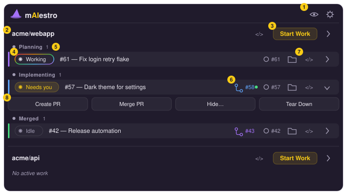
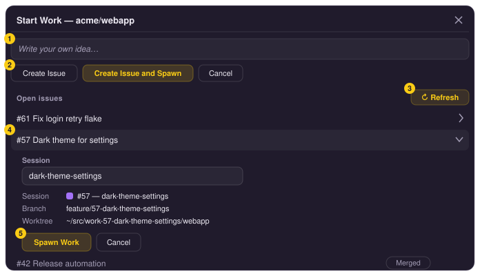

# mAIestro

## Why mAIestro

Getting real leverage out of AI coding means running **several agent sessions
in parallel** — one drafting a fix, another reviewing, a third exploring an
idea. The bottleneck stops being any single session and becomes *you*: the
constant context switching between them, keeping track of which one is working,
which is blocked on your input, and which finished and needs a look. That
juggling is the hard part, and it's what mAIestro exists to solve.

mAIestro is deliberately **not** another place to chat with an agent. It
doesn't get in the way of your session interactions — the conversation still
happens in your editor or terminal, exactly as it would without it. Instead
it's the **shell around your sessions**: a single dashboard that shows what each
one is doing and where your attention is needed next, so switching between them
is a glance instead of a hunt.

## What it is

A macOS menu-bar app that quickly shows active AI coding sessions. Features include:

- **One worktree per issue.** Spawn Work on an issue creates a branch and a
  worktree (e.g. `~/src/work-42-fix-thing/repo`), runs your setup commands, and
  opens your editor.
- **Live session status.** Each row shows what the AI engine is doing — working,
  waiting for you, idle.
- **Idea → issue.** Type a rough idea and AI drafts the GitHub issue title
  and body before anything is created.
- **PRs from the dashboard.** Create an AI-drafted pull request for a
  workspace, watch its checks, and merge it — then tear the worktree down.
- **Multiple git repo support.** Work on multiple repos at the same time.
- **Visibility and snooze controls.** Just focus on your active work. If there is a repo or work item you want to pause, just hide or snooze it for a couple of days.
- **Color coded sessions.** Each session is assigned a color and emojis for remote control sessions, so it is easy to find across multiple windows.
- **Per-identity GitHub access.** GitHub tokens are stored in the macOS
  Keychain per identity; each repo is tracked under the identity you choose.

## Installation

Download the latest `.dmg` from the
[Releases page](https://github.com/emisch0/maiestro/releases) and drag
**mAIestro** to Applications. Builds are signed and notarized, so the app opens
without Gatekeeper warnings.

macOS only for now (Windows/Linux are a goal, not a promise). You'll also want
`git` and [Claude Code](https://claude.com/claude-code) installed and logged
in — spawned sessions run under your own `claude` login and your ambient git
auth.

## Quick start

1. Click the brain icon in the menu bar and open **Settings**.
2. In **Identities**, add an identity (e.g. `default`) and save a GitHub
   personal access token for it. The token goes into the macOS Keychain;
   `~/.maiestro/profiles.json` keeps only a reference to it.
3. In **Repos**, click **Add Repo**, pick the identity, and choose a repository
   from the fetched list. Point its settings at your local checkout if it isn't
   at the default `~/src/<repo-name>`.
4. Back in the popover, the repo lists its open issues. Hit **Spawn Work** on
   one — mAIestro creates the worktree, copies your env files, runs your
   post-spawn commands, and opens the editor with Claude working the issue.
   Or write your own idea and let Claude draft the issue first.
5. When the work is ready, create the PR from the workspace row (Claude drafts
   the description), merge it once checks pass, and tear the workspace down.

## The main window

An annotated tour of the popover (illustrative diagram, not a screenshot):

<p align="center">
  
</p>

1. **Show-hidden toggle and Settings** — the eye reveals hidden/snoozed repos
   and workspaces; the gear opens the Settings window (identities, repos,
   appearance).
2. **Repo group** — one section per tracked repo, with a button to open its
   checkout in VS Code.
3. **Start Work** — opens the issue picker for this repo (next diagram).
4. **Claude status pill** — the session's live state, fed by Claude Code hooks:
   *Working* (rainbow ring), *Needs you* (amber — e.g. a permission prompt),
   *Ready*/*Idle* (muted). Click it to jump into the session's editor. A red
   tint means a tool call failed and Claude stopped without recovering; the
   error shows inline and can be dismissed.
5. **Lifecycle zones** — workspaces are grouped as *Planning* → *Implementing*
   (a PR exists) → *Merged*, and slide between zones as their phase changes.
6. **PR pill** — links to the workspace's pull request; the dot is the live
   checks status (green passing, spinning while running).
7. **Quick links** — open the issue on GitHub, reveal the worktree in Finder,
   or open it in VS Code.
8. **Command strip** (expand a row with its chevron) — *Create PR* (Claude
   drafts the description from the diff), *Merge PR* (creates the PR if
   needed, waits for checks, merges), *Hide…* (snooze the row), and *Tear
   Down* (remove the worktree; warns about uncommitted or unpushed work).
   While an operation runs, the row shows a busy pill — *Creating…*,
   *Creating PR…*, *Merging…*, *Tearing down…*.

Clicking **Start Work** opens the issue picker:

<p align="center">
  
</p>

1. **Idea box** — describe what you want in plain words; Claude turns it into
   a titled GitHub issue.
2. **Create Issue / Create Issue and Spawn** — file the drafted issue, or file
   it and immediately spawn a workspace for it.
3. **Open issues** — the repo's open issues, refreshable; issues that already
   have a workspace sink to the bottom with their phase.
4. **Spawn preview** — expanding an issue shows what will be created: an
   editable short session label (drafted by Claude) plus the derived
   workspace, branch, and worktree path.
5. **Spawn Work** — creates the worktree, copies env files, runs post-spawn
   commands, and opens the editor with Claude briefed on the issue.

## Configuration

Everything lives under `~/.maiestro/`, in human-editable JSON that plays well
with dotfile tooling. The Settings window is the GUI over the same files.

| Path | What it holds |
| --- | --- |
| `profiles.json` | Identities and references to their Keychain credentials (never the secrets themselves) |
| `repos/<owner>-<name>.json` | Per-repo settings (see below) |
| `settings.json` | App-wide settings: popover size, theme (`light`/`dark`/`system`) |
| `sessions/` / `status/` | Workspace records and live session status (managed by the app) |

Per-repo settings cover the local checkout path (`checkout_dir`), where
worktrees are created (`worktree_prefix`), `.env` files to copy into each new
worktree (`env_files`), shell commands to run after a worktree is created
(`post_spawn_commands`, e.g. `pnpm install`), and overrides for the prompts
mAIestro sends Claude when drafting issues, labels, and PRs (`prompts`).

The format is specified by a JSON Schema at
[`backend/schemas/repo-settings.schema.json`](backend/schemas/repo-settings.schema.json)
(bundled with the app at
`/Applications/mAIestro.app/Contents/Resources/schemas/repo-settings.schema.json`).
Point a `$schema` key at it for autocomplete when hand-editing.

Logs are written to `~/Library/Logs/com.maiestro.app/lYYYYMM/maiestro-YYYYMMDD.log`
(UTC-dated, daily rollover) and are viewable from the app's Logs window.

## Development

Built with [Tauri v2](https://tauri.app): a Rust backend and a React + Vite +
TypeScript frontend.

```
maiestro/
  backend/          # Rust / Tauri: tray, windows, git/GitHub, spawning, hooks
    src/main.rs
    tauri.conf.json
    schemas/        # JSON Schema for the per-repo settings file
    icons/          # app + tray icons
  frontend/         # React + Vite frontend (popover, Settings, Logs windows)
  scripts/          # release.sh — bump / build / publish pipeline
  vite.config.ts    # Vite config (root = frontend/)
  package.json      # JS deps + scripts (dev/build/tauri)
```

### Prerequisites

Install these once. Versions in parentheses are what this was developed
against.

| Tool | Why | Install |
| --- | --- | --- |
| **Homebrew** | macOS package manager used to install Node/pnpm | `/bin/bash -c "$(curl -fsSL https://raw.githubusercontent.com/Homebrew/install/HEAD/install.sh)"` |
| **Xcode Command Line Tools** | C toolchain + macOS SDK that Rust/Tauri link against | `xcode-select --install` |
| **Rust** (1.95) | Compiles the Tauri backend | `curl --proto '=https' --tlsv1.2 -sSf https://sh.rustup.rs \| sh` |
| **Node.js** (25) | Runs Vite and the Tauri CLI | `brew install node` |
| **pnpm** (10) | Package manager for the frontend | `brew install pnpm` |

After installing Rust, restart your shell (or `source "$HOME/.cargo/env"`) so
`cargo` is on your `PATH`.

### Develop

```bash
pnpm install     # frontend deps + Tauri CLI (use pnpm, not npm)
pnpm tauri dev   # Vite dev server + the app
```

The first build compiles the full Rust dependency tree and takes a few
minutes; later builds are incremental. Dev builds are ad-hoc-signed, so macOS
re-prompts for Keychain access after each rebuild — expected; only the signed
release build keeps the grant.

### Build and release

```bash
pnpm tauri build
```

produces a `.app` and `.dmg` under `backend/target/release/bundle/` (unsigned
unless you provide signing credentials).

Real releases go through [`scripts/release.sh`](scripts/release.sh) — three
idempotent phases (`bump`, `build`, `publish`) that version-bump, build a
signed + notarized `.dmg`, and publish a GitHub Release. Signing and
notarization credentials live in a gitignored `.env.release` (template:
[`.env.release.example`](.env.release.example)). The `/release` Claude Code
skill drives the whole pipeline.

To regenerate the icon set in `backend/icons/` from a source PNG:

```bash
pnpm tauri icon path/to/source.png -o backend/icons
```

## Architecture

The recorded design decisions live in [`CLAUDE.md`](CLAUDE.md) — that file is
the source of truth; the short version:

- **mAIestro launches sessions, it doesn't host them.** Starting work opens a
  real VS Code window or terminal running `claude`; the app never owns the
  conversation or its stdio.
- **Session status comes from Claude Code hooks.** Spawning writes hooks into
  the worktree's `.claude/settings.local.json` that call the mAIestro binary,
  which writes status files the app watches.
- **GitHub via the REST API, never `gh`.** The app talks to GitHub directly
  with per-identity tokens read from the Keychain at call time.
- **Secrets in the Keychain, references in JSON.** `~/.maiestro/` holds only
  human-editable configuration; token values never touch disk.
- **Launched sessions get your ambient environment.** Launches go through
  Launch Services / your login shell, so sessions inherit your PATH, git auth,
  and `claude` login — mAIestro injects nothing.
